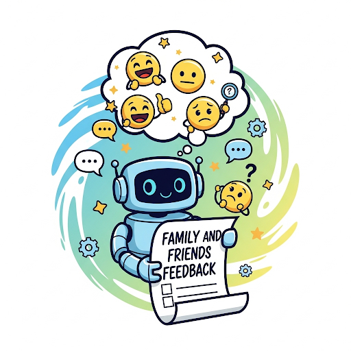
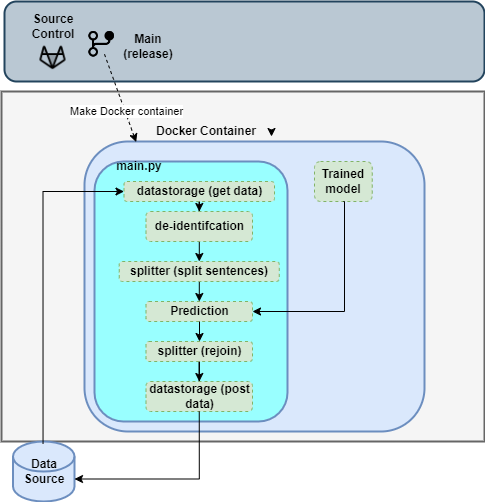
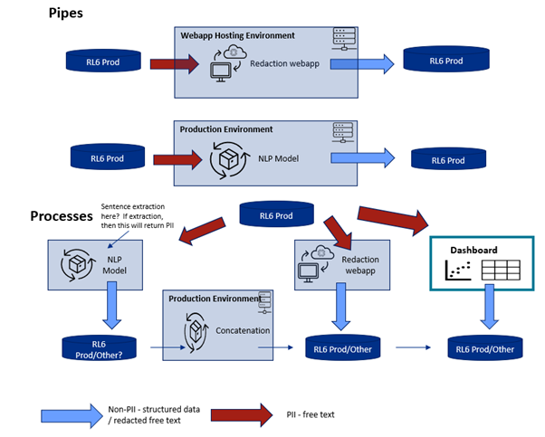

<div style="text-align:center">
  
</div>

# Themiator
---

## 🚀 Introduction
Implementation of an NLP workflow that pre-processes patient/parent feedback of GOSH patient that comes in through data collection directly from parents with a mobile app or data entry by routine data entry the patient experience team engages in.

### Using the FFT pipeline

### Finetuning Workflow


For fine-tuning SetFit based pipeline components, please refer to [Setfit's documentation on Huggingface](https://huggingface.co/docs/setfit/how_to/classification_heads).


The base models used for Setfit fine-tuning are:

- Sentence Transformer for SetFit: [distilbert-base-uncased__sst5__all-train](https://huggingface.co/docs/transformers/en/model_doc/distilbert)

Please note that the Sentiment model expects to be trained with labels below: "negative/neutral/positive" and the theme model expects to be trained with labels below:

- Unclassified
- Respect for patient-centred values
- Coordination and integration of care
- Information and education
- Physical comfort
- Emotional support
- Involvement of friends and family
- Transition and continuity
- Access to care
- General


### Workflow
This pipeline conducts the following tasks:
1. Data import of most recent data, which is mostly the previous day's entered comments from a Microsoft SQL database.
2. Automatic de-identification of patient and healthcare names from the comments.
3. Sentence splitting, which preprocesses the HTML data and smarty splits into separate individual sentences using tokenization.
4. Prediction of sentiment (negative, neutral, or positive) and theme, which spans across the following 10 NHS patient experience 2022 themes:
    - Unclassified,
    - Respect for patient-centred values
    - Coordination and integration of care
    - Information and education
    - Physical comfort
    - Emotional support
    - Involvement of friends and family
    - Transition and continuity
    - Access to care and
    - General
5. Sentence Rejoining based on similarity of sentiment and theme predictions for sentences coming from same comment, whilst maintaining their original order.

#### Overview of the docer container


#### Overview of the overall system


### Deployment
The FFT NLP pipeline has been packaged as a python application that incorporates code from the prediction, sentence splitting and auto-redaction. A docker image has been created based on Python 3.9.16, that runs a crontab file to automate the prediction.

However, the usability of this will depend on trust authentication policies. If it is not possible to use cron, e.g. if authentication credentials do not last long enough, then it can be run manually.


Output consists of:
1. Theme and sentiment classes.
2. Consensus  scores for theme prediction and sentiment prediction
3. Date the pipeline was ran
4. Version of the pipeline.

## 📚 Installations

### Requirements
The models are built using a SetFit-DistilBERT model and the deberta-base-long-nli model is used to provide a confidence score is from Hugging Face.

#### To build FFT NLP docker image
If the image on the container registry cannot be pulled it can be built locally.

1. Clone FFT NLP pipeline repo.
```
git clone https://github.com/gosh-dre/FFT-NLP-Pipeline
```
2. Change directory to the root of the repo
```
cd fft
```

3. Build dependency image
```
docker build -f Dockerfile.dependency -t fft:fft_dependencies .
```

4. Specify key details in `config.yaml`. This includes the database FFT data is held in and the destination table for predictions.

5. Create docker image
```
docker build -t fft:main .
```

#### To run FFT NLP container

1. Make a folder `fft_log` on host system with a log file (`fft.log`)

2. Run the docker container
```
docker run --name fft_container fft run -v [full_path_to_folder]/fft_log:/app/fft_log -v [path to models]:/app/ext_models --name fft fft:main
```
where `fft_container` is the container name you want to assign to the docker image: `fft`. Note: logs will not be made unless the full path to the log folder is given.

3. Login/Enter the running container
```
docker exec -it fft_container /bin/bash
```

4. Authenticate connection to database and make any changed necessary to config.yaml, as described previously.

5. `python main.py`

6. The output can be inspected as described previously.

##  🤝 Acknowledgements
* DRIVE team
* Pavithra Rajendran (Code Reviewer)
* Jonny Sheldon (Developer)
* Victor Banda (Past developer)

##  🤝 Contributors
* Ewart Jonathan Sheldon - Software Engineer (Research) @ GOSH DRIVE (Core Contributor)
* Jaskaran Singh Kawatra - Machine Learning Engineer @ GOSH DRIVE
* Dr. Pavithra Rajendran - NLP & Computer Vision Lead @ GOSH DRIVE
* Sebin Sabu - Data Scientist @ GOSH DRIVE
* Caroline Baumgartner - Data Scientist @ GOSH DRIVE
* Victor Banda - Data Scientist @ GOSH DRIVE (Past Member)


## Citing & Authors

If you find this repository helpful, feel free to cite our publication:

### Primary Citation

```bash
@article{
    title = "ECAI Context Beyond Simple Rules: Deploying an Automated NLP-Based Pipeline for Sentiment and Theme Prediction in Paediatric Healthcare Setting",
    author = "Baumgartnera, Caroline and Sheldon, Ewart Jonny and Sabu, Sebin  and Kawatra, Jaskaran Singh and Rajendran, Pavithra  Patel, Shiren and Harris, Mark and Collin, Suzanne and Kapadia, Taraben"
    booktitle = "to be updated",
    month = "to be updated",
    year = "to be updated",
    publisher = "to be updated",
    url = "to be updated",
}
```

## Contact

To contact the team please email [DRESupport\@gosh.nhs.uk](mailto:DRESupport@gosh.nhs.uk){.email}

## Disclaimer

DISCLAIMER – this openly published repository represents a “major version” snapshot of a project that is not actively developed on Github. Therefore, anyone using all or part of this repository must take responsibility for ensuring the use of up-to-date secure versions of relevant packages and code interpreters when running the code. As stated in the license, the software is provided “as is” without any kind of warranty. For more information, please refer to the license file in the repository.

## Licenses

All code is released under the [MIT License][mit]. All documentation is [© Crown copyright][copyright] (2025) and available under the terms
of the [Open Government License 3.0][ogl].

[mit]: LICENSE
[copyright]: http://www.nationalarchives.gov.uk/information-management/re-using-public-sector-information/uk-government-licensing-framework/crown-copyright/
[ogl]: http://www.nationalarchives.gov.uk/doc/open-government-licence/version/3/
