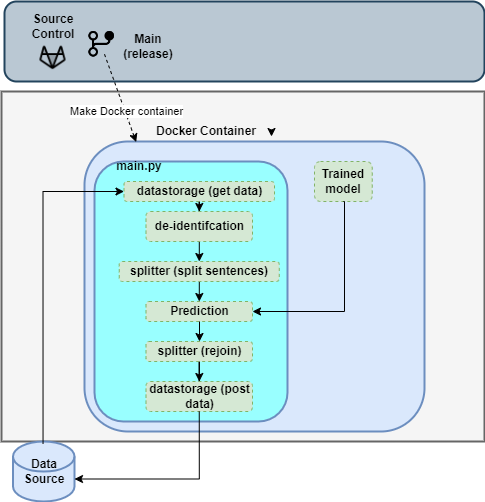

# Friends and Family Test (FFT) NLP Pipeline
---
Implementation of an NLP workflow that pre-processes patient/parent feedback of GOSH patient that comes in through data collection directly from parents with a mobile app or data entry by routine data entry the patient experience team engages in.

Created by Imperial College London, as part of the "Scale, Spread and Embed" project, it seeks to use digital processing of the FFT data to drive improvements in patient and family experience.

## Using the FFT pipeline

### Workflow
This pipeline conducts the following tasks:
1. Data import of most recent data, which is mostly the previous day's entered comments from a Microsoft SQL database.
2. Automatic Redaction of identifiable texts in the comments, which is mostly patient and healthcare names.
3. Sentence splitting, which preprocesses the HTML data and smarty splits into separate individual sentences using tokenization.
4. Prediction of sentiment (negative, neutral, or positive) and theme, which spans across the following 10 NHS patient experience 2022 themes:
    - Unclassified,
    - Respect for patient-centred values
    - Coordination and integration of care
    - Information and education
    - Physical comfort
    - Emotional support
    - Involvement of friends and family
    - Transition and continuity
    - Access to care and
    - General
5. Sentence Rejoining based on similarity of sentiment and theme predictions for sentences coming from same comment, whilst maintaining their original order.



### Deployment
The FFT NLP pipeline has been packaged as a poetry project that incorporates code from the prediction, sentence splitting and auto-redaction Jupyter notebooks that Imperial College London handed to GOSH. We have modularized the code and created Python modules to handle each of the core functions. A docker image has been created based on Python 3.8.16, that runs a crontab file to automate the prediction.

However, the usability of this will depend on trust authentication policies. If it is not possible to use cron, e.g. if authentication credentials do not last long enough, then it can be run manually.


Output consists of:
1. Theme and sentiment classes.
2. Consensus  scores for theme prediction and sentiment prediction
3. Date the pipeline was ran
4. Version of the pipeline, which is indicative of a milestone, such as running on staging environment vs running locally on a laptop, running from a poetry project, running from a modularised codebase or running from Jupyter notebook.

## Running

### Requirements
The models used for prediction can be provided by Imperial under an NHS license. and these will need to be added in the `models` folder.

### Running locally
1. Install dependencies using [poetry](https://python-poetry.org/)
```bash
poetry install
```
2.  Make any changed necessary to config.yaml, e.g. if it is being run on Monday morning `daysToRetrieve` will need to be changed to 4 to account for the weekend.

3. Use Python to run the process.
```bash
python main.py
```
An output like this will be seen:

An output will appear on the screen:
 ```bash
$ python main.py
  0%|          | 0/14 [00:00<?, ?it/s]
  0%|          | 0/14 [00:00<?, ?it/s]
  0%|          | 0/14 [00:00<?, ?it/s]
  0%|          | 0/14 [00:00<?, ?it/s]
... finished autoredacting ...
... finished sentence splitting ...
... assigned column list ...
SentimentScores
ThemeScores
... finished predicting ...
... finished rejoining ...
.... exported final view ...
 ```
If there is no new data an error will be produced:
```bash
$ python main.py
Traceback (most recent call last):
  File "main.py", line 30, in <module>
    director.run_builder()
  File "/app/scripts/builder/director.py", line 33, in run_builder
    self.builder.clean_text()
  File "/app/scripts/builder/generic_linux_builder.py", line 61, in clean_text
    self.cleaned_df = pd.concat(data)
  File "/usr/local/lib/python3.8/site-packages/pandas/core/reshape/concat.py", line 244, in concat
    op = _Concatenator(
  File "/usr/local/lib/python3.8/site-packages/pandas/core/reshape/concat.py", line 304, in __init__
    raise ValueError("No objects to concatenate")
ValueError: No objects to concatenate
```

4. The output will be in database in the table specified in the config and can be checked by running the following SQL query:
```
select * from [Output database table name] where cast([DateRan] as date) = '2023-11-01';
```
where `2023-11-01` is the desired date.

### Running in Docker

#### To build FFT NLP docker image

1. Clone FFT NLP pipeline repo.
```
git clone https://gitlab.pangosh.nhs.uk/dre-team/re0273-fft.git
```
1. Change directory to the root of the repo
```
cd re0273-fft
```

1. Specify key details in `config.yaml`. This includes the database FFT data is held in and the destination table for predictions.

2. Create docker image
```
docker build -t fft .
```

#### To run FFT NLP container

1. Run the docker container
```
docker run --name fft_container fft
```
where `fft_container` is the container name you want to assign to the docker image: `fft`

1. Login/Enter the running container
```
docker exec -it fft_container /bin/bash

```
3. Enable Kerberos authentication mode.
```
KRB5_CONFIG=krb5.conf kinit [username]
```
The cronjob should now run `main.py` automatically. If this fails run the code manually as below:

4. Make any changed necessary to config.yaml, as described previously.

5. `python main.py`

6. The output can be inspected as described previously.


## Further information

### Core Contributors
- Jonny Sheldon (Maintainer)
- Victor Banda (Past Member)

### Publications

- Banda V, Bryant W, Collin S, et al. 47 Operationalising a friends and family test natural language processing pipeline. BMJ Paediatrics Open 2023;7:doi: 10.1136/bmjpo-2023-GOSH.14


### Acknowledgements

- Clinical Analytics & Digital Health Team Imperial College London
- Great Ormond Street Hospital Patient Feedback Team

### Licenses

Code in this repository is covered by the MIT License and for all documentation the [Open Government License (OGL)](https://www.nationalarchives.gov.uk/doc/open-government-licence/version/3/) is used.

Copyright (c) 2024 Crown Copyright